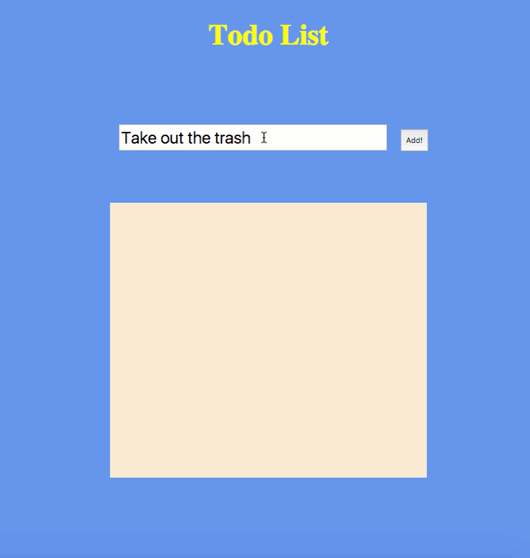

# List App with jQuery


## Instructions
Use the provided starter HTML to make a list app. This app will take text from an input box and display it in another box elsewhere on the page. Add a way to click and delete the entries you add, too.

* Bonus:
  * Add a new entry when you press the `return` key;
  * Style it.
## Info
An example of the functionality:




### Starter Code
```
<!DOCTYPE html>
<html lang="en">
<head>
  <meta charset="UTF-8">
  <title>Todo</title>
  <style>

  </style>
</head>
<body>
  <h1>Todo List</h1>

  <input type="text" id="newtask">
  <button id="add">Add!</button>

  <div id="tasks"></div>
  <script src="https://code.jquery.com/jquery-2.2.1.min.js"></script>
  <script src="app.js"></script>
</body>
</html>

```
